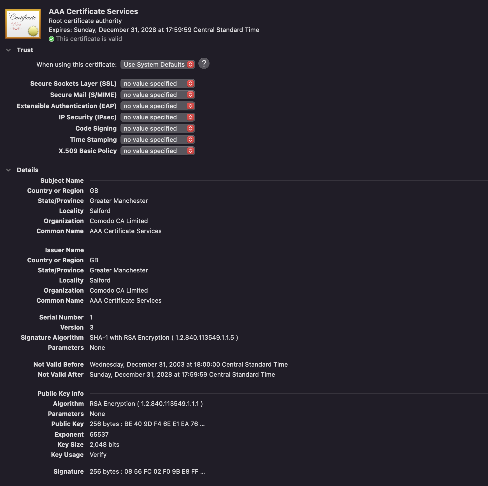

# Homework 2
- Name: Nguyen Cat Nguyen
- KUID: 3077463

## Authentication
### 1. 
```
a. Please explain how could the AS verify the secret key K_Alice. 
b. What is K_1? Who generate it? 
c. Can Alice read the content of Ticket_TGS? Can Alice forge the ticket? Can Alice reuse the ticket in another time? 
d. How could the ticket-granting server authenticate Alice? 
```

a. The AS can verify the secret key K_Alice by compare the password Alice used to login with the password stored in the 
database. If they are the same, the AS will know that Alice is the owner of the password and the secret key K_Alice.
b. K_1 is a session key generated by the TGS. The TGS will generate K_1 and send it to Alice.
c. Alice cannot read the content of the ticket because the ticket is encrypted by K_1.
    - She can't forge the ticket because the ticket is encrypted by K_1 and she doesn't know K_1.
    - She can't reuse the ticket in another time because the ticket is encrypted by K_1 and she doesn't know K_1.
d. The ticket-granting server can authenticate Alice by using the Ticket_TGS. If the decryption of the Ticket_TGS is successful, 
the TGS will know that Alice is the owner of the Ticket_TGS and the secret key K_Alice. Else the access will be denied.
### 2. 
```
Please explore the certificates pre-installed in your browser and pick one certificate as an example to show its CA, the 
principal, signature, timestamp, and expiration.
``` 
- I pick the certificate of `AAA Certificate Services` as an example.
- The CA is `AAA Certificate Services`.
- The principal is `AAA Certificate Services`.
- The signature is `SHA-1 with RSA Encryption ( 1.2.840.113549.1.1.5 )`.
- The timestamp is `Wednesday, December 31, 2003 at 18:00:01 Central Standard Time`.
- The expiration is `Sunday, December 31, 2028 at 17:59:59 Central Standard Time`.




## Database Security
### 3.
```To prevent the inference attacks, the database systems implement multiple controls. Please list these controls discussed in the 
lecture and pick one to explain which type of inferences it prevents. 
```
- There are three controls to prevent inference attacks:
    - Query controls
    - Item controls
    - Partitioning
- Queue controls: 
    - Limit overlap between new and previous queries by prevent unauthorized access to sensitive data through the use of query controls.
### 4. 
```
What is the tracker attack? Can we use access control to prevent this attack? If so, briefly explain 
how this access control could be impletemented? 
```
- `Tracker attack`: is a type of privacy attack that the attacker monitors the user's online activities and uses the information to infer 
the user's private information.
- Yes, we can use access control to prevent this attack. Access control help limiting the amount of data that can be collected by the attacker.
- There are many way to implemented access control, one of it is use SQL implements access control with database privileges. First we need 
to identify the database object that need to be protected, define the privileges required for each object, then grant the privileges to the users.
## Operating System Security 
### 5. 
```
What is protection domain?  
```
- `Protection domain`: is a collection of objects to which a process has access. It defines the set of rules or access controls that govern 
the interations between the resources and the software.

### 6. 
```
Protection domains can be implemented with access control matrix. Consider a system with 3 files (F1-F3) and a printer. 4 protection domains 
are defined: (1) a process running in domain D1 can read files F1 and F3; (2) a process in domain D2 can read F2, write F3, and execute F1; 
(3) a process in domain D3 can print files to printer; (4) a process in D4 has the same privileges as the one in D2. In addition, it can also 
read F3 and write F2. Could you please compose an access control matrix to describe the protection domains in this system
```
- The table is:

| | F1 | F2 | F3 | Printer |
| --- | --- | --- | --- | --- |
| D1 | R | - | R | - |
| D2 | Execute | R | W | - |
| D3 | - | - | - | P |
| D4 | Execute | R,W | R,W | - |

### 7. 
```
Set user (setuid) and set group (setgid) programs are powerful mechanisms provided by the Unix 
system to manage access to sensitive resources through control invocation. However, because of 
this, this mechanism has potential security risk. Bugs in such programs have led to many 
compromises. Please briefly explain why this mechanism is needed in Unix and which security 
problems a bugged setuid program may cause
```
- The setuid and setgid mechanism in Unix is necessary as it enables a user to execute a program with the privileges of another user or group. 
This is particularly useful when a user requires temporary access to a sensitive resource that requires higher privileges than their own permissions.

- A bugged setuid program may cause the following security problems:
    - Buffer overflow
    - Injection flaw
- The program may be used to gain access to sensitive resources that the user is not authorized to access.
- The program may be used to gain access to resources that the user is authorized to access, but not in the way that the program is intended to be used.

## Software Security
### 8. 
```
Explain how to use “NOP sledding” to assist buffer overflow attacks.
```
- `NOP sledding` can be use to improve the success of guessing the address of the return address. The idea is to insert a large number of NOP 
instructions before the return address. This will increase the number of possible addresses that can be used to overwrite the return address. 
That way it will be easier to guess the correct address.

### 9. 
```
Standard C library functions such as gets(), strcpy(), sprint() are unsafe. Take gets() and fgets() as an 
example, explain why fgets() is more secure.
```
- `fgets()` is more secure than `gets()` because `fgets()` will check the length of the input and will stop reading when the buffer is full.
It also reads input from stdin until a newline character or EOF is encountered.

### 10. 
```
The below program has a buffer overflow vulnerability. Please identify the unsafe function used in 
the program and explain why. 
```

```c
 void hello(char *tag){
    char inp[16];
    printf("Enter value for %s: ", tag);
    gets(inp);
    printf("Hello your %s is %s\n", tag, inp);
 }
```
- The unsafe function used in the program is `gets()`. Because the `get()` function doesn't check the length of the input, it will cause buffer 
overflow if the input is longer than the buffer.

