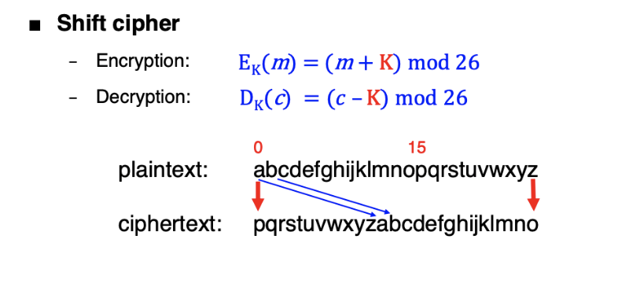
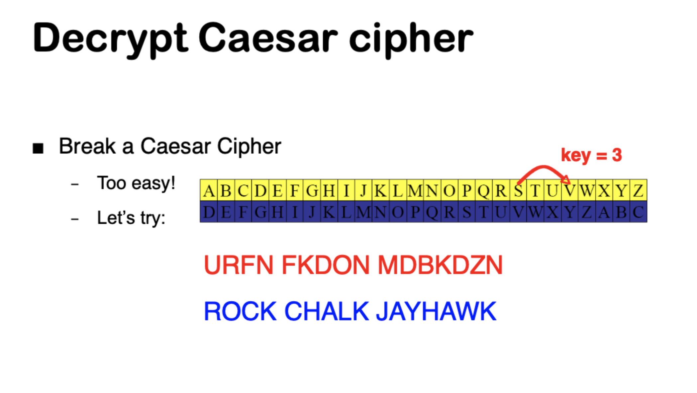
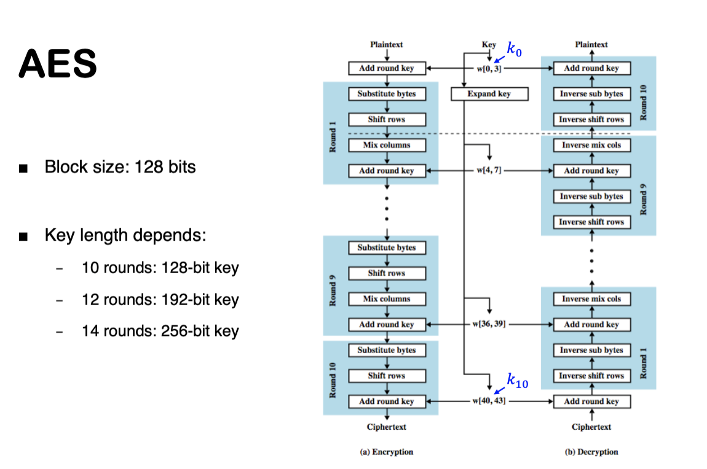
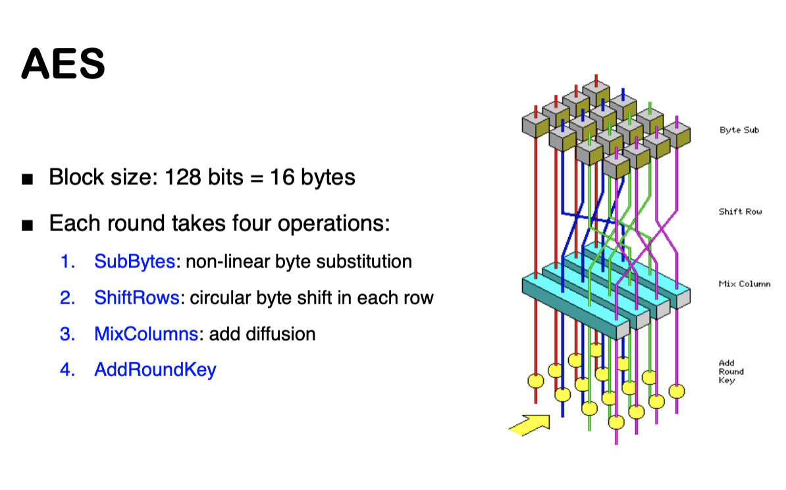
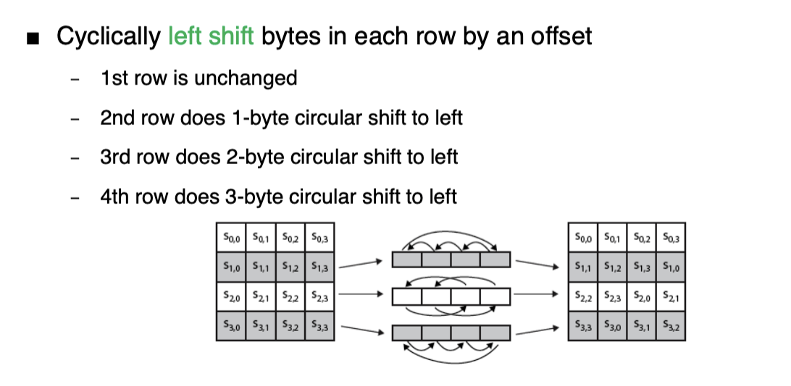
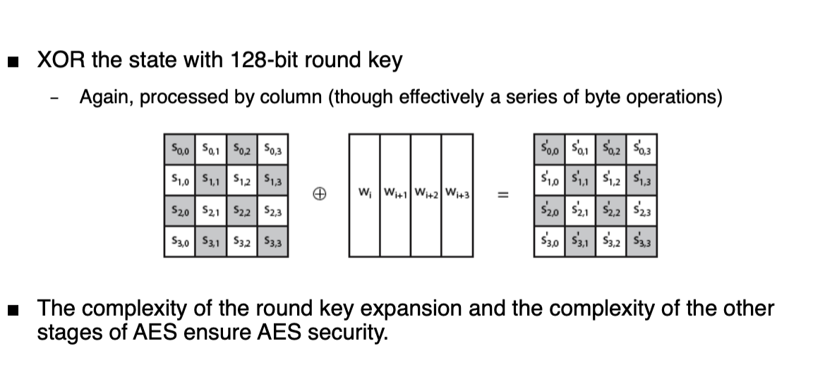
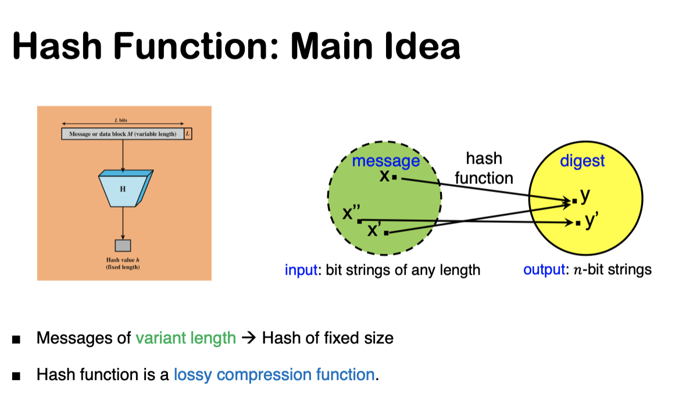

# Information-Security

## Index
- [Lecture 1: Introduction](#lecture-1-introduction)
- [Lecture 2: Information Security](#lecture-2-information-security)
- [Lecture 3: Classic Cryptography](#lecture-3-classic-cryptography)
- [Lecture 4: Symmetric cryto](#lecture-4-symmetric-cryto)
- [Lecture 5: Block Cipher DES](#lecture-5-block-cipher-des)
- [Lecture 6: Block Cipher and Modes of Operation](#lecture-6-block-cipher-and-modes-of-operation)

***
 
## Lecture 3: Classic Cryptography 
### Table of Contents
- [I. Security goals](#i-security-goals)
- [II. Terminology: Cryptography](#ii-terminology-cryptography)
    - [1. Cryptography](#1-cryptography)
    - [2. Cryptosystem](#2-cryptosystem)
    - [3. What should we know?](#3-what-should-we-know)
- [III. Classic Cryptography.](#iii-classic-cryptography)
### Terminology
- `Cipher` is a method of hiding the meaning of a message
- `Cipher attack` is a method of breaking a cipher
- `Ciphertext` is the result of encryption 
- Terminology: Cryptography, Cryptosystem
- Caesar cipher, shift ciphers, substitution ciphers
- Frequency analysis
- Terminology: Cryptanalysis, Cryptology.
- Vigenere cipher, polyalphabetic ciphers.
### I. Security goals
- Confidentiality : only sender and the intended receiver understand message  content.
- Message integrity: receiver can ensure message is not altered ( in transit or afterwards)
- End-point authentication: sender and receiver can confirm the identity of each other.

### II. Terminology: Cryptography
#### 1. Cryptography
- Cryptography conceals data against unauthorized access
    - It includes encipherment, digital signature, authentication exchange,..
    - Intruder who may try to block, intercept, modify, or fabricate the message
        - Eve: eavesdropper
        - Mallory: malicious attacker
- `Encryption` is the process of encoding a message so that its meaning is not obvious.
- `Decryption` is the process of decoding a message so that its meaning is obvious.
#### 2. Cryptosystem
- Cryptosystem is a system for encryption and decryption
    - A cryptographic algorithm
    - A set of all possible plaintexts
    - A set of all possible ciphertexts
    - A set of all possible keys
- Cryptographic algorithm (aka cipher) is a mathematical function that transforms plaintext into ciphertext.
    - The algorithm that takes a key to convert plaintext to ciphertext and back. 
#### 3. What should we know?
- To understand cryptography, we want to know:
    1. The way in which the plaintext is transformed into ciphertext
        - cryptographic algorithms.
    2. The way in which the plaintext is processed
        - block ciphers, stream ciphers
    3. How key is generated and used
        - 1 key, 2 key, no key
### III. Classic Cryptography.
#### 1. Caesar cipher
- Every character is replaced with the character 3 slots to the right
- Example: 
    - Plaintext: `ATTACKATFIVE`
    - Ciphertext: `DWWDFNDWIKLH`
    - One of the oldest cryptosystems
    - A very simple `shift cipher`, which is a monoalphabetic `substitution cipher`.
#### 2. Shift ciphers

- Encryption: Ek(m) = (m + k) mod 26
- Decryption: Dk(c) = (c - k) mod 26
- The minimum value of K is 1
### Decryption

### Substitution ciphers
- How to break it
    - Brute force attack
        - How many posible substitution alphabet?
            - 26! = 4.032.914.560.992.000.000
        - Let try all permutation
- What can be cryptographers' counter-moves?
    - *Polyalphabetic ciphers*
        - Use multiple substitution alphabets
    - *Homophonic ciphers*
        - multiple possible  output characters for an input character
    - *Polygraphic ciphers*
        - Encipher groups of letters at once

### Cryptonalysis
- Cryptanalysis is the study of how to break a cryptosystem

### Vigeneré cipher
- A polyalphabetic cipher
- How to break a Vigenere cipher
    - Diffucult in general
    - First, find the key length
        - Could use brute force attack to try all possible key length
    - Then for each key length
***
## Lecture 4: Symmetric cryto
### Vernam Cipher
- Plaintext and keystream are both letters
- Key is the same length as plaintext
- ciphertext = plaintext + key (mod 26)
#### Vernam cipher machine
- Three tapes: plaintext, key, ciphertext

    `This also know as the one-time pad`
#### One-Time Pad (OTP)
- The `same key` is used for encryption and decryption - a secret key encryption scheme.
- Example
##### What potential problems does OTP have?
- Key must be as long as the plaintext
    - This requirement is impractical in most realistic scenarios. For highly confidential traffic such as diplomatic and intelligence communication.
- Key must be truly random
    - Key must be as long as the plaintext.
    - Insecure if the key is reused
        - Attacker can directly obtain XOR of the plaintexts. 
- No guarantee of integrity 
    - Attacker can change the ciphertext without being detected
    - Attacker cannot recover plaintext, but can easily change it to something else. 
### Cipher design techniques
- `Substitution` one set of bits is exchange for another.
- `Transposition` rearrange the order of ciphertext to break the repeated patterns in the plaintext. 
#### Transposition ciphers
- Core idea: rearrange the order of ciphertext to break the repeated patterns in the plaintext.
- Columnar Transposition:
    - Use a two-dimensional array
    - Write plaintext in rows
    - Read ciphertext in columns
##### General Transposition
- How to determine if it is a transposition cipher?
    - We can use common letter pains (diagrams), triples (trigrams) to figure out d.
    - Transposition is a permutation.
- To make it stronger, we can combine substitution and permutations
    - Substitution adds confusion
    - Transposition adds diffusion
##### Combination of Approaches
- `Confusion` make the relationship between plaintext and ciphertext as complex as posible
- `Diffusion` dissipate the statiscal structure of the plaintext in the longrange statistic of the ciphertext. 
#### Cryptography
- A good cryptosystem should be infeasible to:
    - enumerate all possible keys
    - find the key from any reasonable anount of ciphertext and plaintext by enumerating possible keys.
    - produce plaintext from ciphertext without the key.
    - distinguish ciphertext from true random values.

### Mordern Cryptography
#### Symmetric Encryption Algorithms
- Two cryptographic primitives
    - Block ciphers
        - Encrypt blocks of plaintext, one block at a time
    - Stream ciphers
        - Encrypt one symbol at a time
***
## Lecture 5: Block Cipher DES

***

## Lecture 6: Block Cipher and Modes of Operation
### Advanced Encryption Standard (AES)
    - AES is a symmetric block cipher
    - Rijndael is Standardized as AES
        - clean,fast, good security margin

### Rijndael 
- Efficient: 
    - Not a Feistel cipher: in each round, it operates on all
bits, instead of just half of them, so 2 rounds provide a full 
diffusion.
- Small number of rounds: 10, 12, or 14 for 128, 192, and 
256-bit keys, respectively.
- For example, 3DES requires 48 rounds, and AES-128 requires 
only 10 rounds.
- Simple implementation: 
    - It view bytes as elements in the finite fiedld GF(2^8), so `substitution`, `permutation`, `shift` operations can be done by table lookups.

### AES State Array
- AES keeps a state array of 4x4 bytes columns
    - Fill in and read out column by column
    - Perform a byte-for-byte substitution on the state array.
    - Padding is necessary if message is not a multiple of 16 bytes.

#### 1. SubBytes
- Byte substitution
    - Use S-box to covert a byte in the input state array into 
    another byte in the output state array. 
    - S-box is a 256-element array (16-by-16 matrix)

#### 2. ShiftRows
- Cyclically `left shift` bytes in each row by an offset. 

#### 3. MixColumns

#### 4. AddRoundKey

### AES Key Expansion
- Key expansion: `wi = f(wi-4, wi-1)`

## Lecture 8: Public Key Cryptography

### Outline
- Modern cryptography
    - Public key Cryptography  (PKC)
        - RSA
        - Diffie-Hellman
        - DSA
        - ECC
    - Hash
    - Message Authentication Code (MAC)

### Digital  Signature Applications
- Authenticated key exchange
- Digital certificates and public key infrastructure

### Elliptic Curve Cryptography (ECC)
- Elliptic curve cryptography (ECC) is a method of public-key cryptography based on the algebraic structure of elliptic curves over finite fields.
- The Koblitz curve `y^2 = x^3 + ax + b`

### Hash Functions

- Hash function is a one-way function
    - It is easy to compute the hash value of a message
    - It is hard to find a message that has a given hash value

# Lecture 10: Authentication - Public Key Infrastructure (PKI)
## Recall: Cryptography
- Secret Key Cryptography
    - Both communicating parties have acess to a shared random string K, called the key
    - How do you securely share a key?
        - 
- Public Key Cryptography
    - Each party creates a public key pk and a secret key sk.
    - Keep sk to yourself and share pk with others.
    - Hard concept to understand, and revolutionary. Inventors won 
## Authenticity of Public Keys
- How do you know if the public key you received is really the correct public key?
    - => This is an authentication problem

## PKI
- **Goal of authentication**: bind identity to card/token/password/key
- **Public key infrastructure (PKI)**: bind identity to public key

## Software Security
### Software Bugs
- Software bugs have two type of security implications:
    - The flaw affects the `correctness` of a program's result.
    - A non-malicious flaw can be `exploited` by attacker maliciously.
### Security vs Quality
- Software security differs from software quality
- Attacks target specific bugs resulting in a failure that can be exploited. 
- The input trigging a bug differs dramatically.
    - Testing a bug is to make sure the code does what it's supposed to do.
    - Testing a security bug is to verify the code doesn't do anything it is not supposed to do. 

### Rootkits
- `Rootkit` is the attack package that attains the root privilege. 
    - Rootkits intercept and change standard OS processes.
