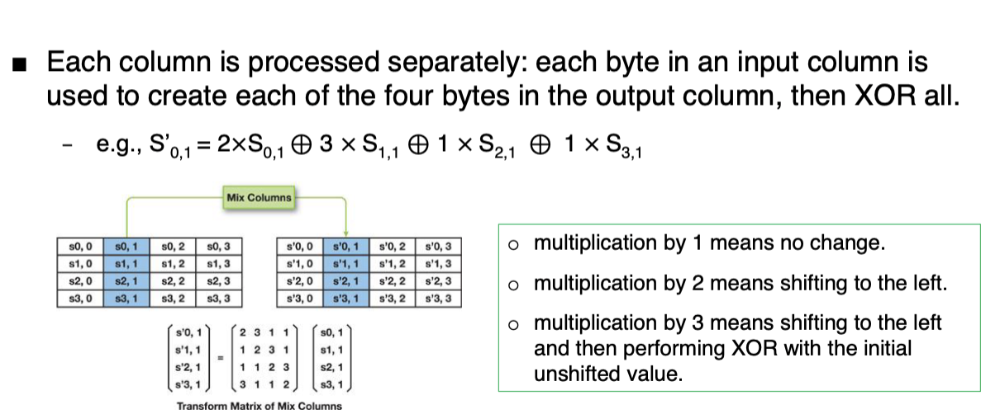

# Information-Security

## Index
- [Lecture 1: Introduction](#lecture-1-introduction)
- [Lecture 2: Information Security](#lecture-2-information-security)
- [Lecture 3: Classic Cryptography](#lecture-3-classic-cryptography)
    - [Security goals](#security-goals)
    - [Terminology: Cryptography](#terminology-cryptography)
        - [Cryptography](#cryptography)
        - [Cryptosystem](#cryptosystem)
        - [What should we know?](#what-should-we-know)
    - [Caesar cipher](#caesar-cipher)
    - [Shift ciphers](#shift-ciphers)
    - [Decryption](#decryption)
    - [Substitution ciphers](#substitution-ciphers)
    - [Cryptonalysis](#cryptonalysis)
    - [Vigeneré cipher](#vigeneré-cipher)
- [Lecture 4: Symmetric cryto](#lecture-4-symmetric-cryto)
    - [Vernam Cipher](#vernam-cipher)
        - [Vernam cipher machine](#vernam-cipher-machine)
        - [One-Time Pad (OTP)](#one-time-pad-otp)
    - [Cipher design techniques](#cipher-design-techniques)
        - [Transposition ciphers](#transposition-ciphers)
            - [Columnar Transposition:](#columnar-transposition)
            - [General Transposition](#general-transposition)
            - [Transposition Cipher Example](#transposition-cipher-example)
    
- [Lecture 5: Block Cipher DES](#lecture-5-block-cipher-des)
- [Lecture 6: Block Cipher and Modes of Operation](#lecture-6-block-cipher-and-modes-of-operation)

 
## Lecture 3: Classic Cryptography 
- Terminology: Cryptography, Cryptosystem
- Caesar cipher, shift ciphers, substitution ciphers
- Frequency analysis
- `Cipher` is a method of hiding the meaning of a message
- `Cipher attack` is a method of breaking a cipher
- `Ciphertext` is the result of encryption
### Security goals
- Confidentiality : only sender and the intended receiver understand message  content.
- Message integrity: receiver can ensure message is not altered ( in transit or afterwards)
- End-point authentication: sender and receiver can confirm

### Terminology: Cryptography
#### Cryptography
- Cryptography conceals data against unauthorized access
    - It includes encipherment, digital signature, authentication exchange,..
    - Intruder who may try to block, intercept, modify, or fabricate the message
        - Eve: eavesdropper
        - Mallory: malicious attacker
- Encryption is the process of encoding a message so that its meaning is not obvious.
#### Cryptosystem
- Cryptosystem is a system for encryption and decryption
- Cryptographic algorithm (aka cipher) is a mathematical function that transforms plaintext into ciphertext

#### What should we know?
- To understand cryptography, we want to know:
    1. The way in which the plaintext is transformed into ciphertext
        - cryptographic algorithms.
    2. The way in which the plaintext is processed
        - block ciphers, stream ciphers
    3. How key is generated and used
        - 1 key, 2 key, no key
### Caesar cipher
- Every character is replaced with the character 3 slots to the right
- Example: 
    - Plaintext: `ATTACKATFIVE`
    - Ciphertext: `DWWDFNDWIKLH`
    - One of the oldest cryptosystems
    - A very simple substitution cipher
### Shift ciphers
- Encryption: Ek(m) = (m + k) mod 26
- Decryption: Dk(c) = (c - k) mod 26
- The minimum value of K is 1
### Decryption

### Substitution ciphers
- How to break it
    - Brute force attack
        - How many posible substitution alphabet?
            - 26! = 4.032.914.560.992.000.000
        - Let try all permutation
- What can be cryptographers' counter-moves?
    - *Polyalphabetic ciphers*
        - Use multiple substitution alphabets
    - *Homophonic ciphers*
        - multiple possible  output characters for an input character
    - *Polygraphic ciphers*
        - Encipher groups of letters at once

### Cryptonalysis
- Cryptanalysis is the study of how to break a cryptosystem

### Vigeneré cipher
- A polyalphabetic cipher
- How to break a Vigenere cipher
    - Diffucult in general
    - First, find the key length
        - Could use brute force attack to try all possible key length
    - Then for each key length

## Lecture 4: Symmetric cryto
### Vernam Cipher
- Plaintext and keystream are both letters
- Key is the same length as plaintext
- ciphertext = plaintext + key (mod 26)
#### Vernam cipher machine
- Three tapes: plaintext, key, ciphertext

    `This also know as the one-time pad`
#### One-Time Pad (OTP)
- The `same key` is used for encryption and decryption - a secret key encryption scheme.
- Example
##### What potential problems does OTP have?
- Key must be as long as the plaintext
    - This requirement is impractical in most realistic scenarios. For highly confidential traffic such as diplomatic and intelligence communication.
- Key must be truly random
    - Key must be as long as the plaintext.
    - Insecure if the key is reused
        - Attacker can directly obtain XOR of the plaintexts. 
- No guarantee of integrity 
    - Attacker can change the ciphertext without being detected
    - Attacker cannot recover plaintext, but can easily change it to something else. 
### Cipher design techniques
- `Substitution` one set of bits is exchange for another.
- `Transposition` rearrange the order of ciphertext to break the repeated patterns in the plaintext. 
#### Transposition ciphers
- Core idea: rearrange the order of ciphertext to break the repeated patterns in the plaintext.
- Columnar Transposition:
    - Use a two-dimensional array
    - Write plaintext in rows
    - Read ciphertext in columns
##### General Transposition
- How to determine if it is a transposition cipher?
    - We can use common letter pains (diagrams), triples (trigrams) to figure out d.
    - Transposition is a permutation.
- To make it stronger, we can combine substitution and permutations
    - Substitution adds confusion
    - Transposition adds diffusion
##### Combination of Approaches
- `Confusion` make the relationship between plaintext and ciphertext as complex as posible
- `Diffusion` dissipate the statiscal structure of the plaintext in the longrange statistic of the ciphertext. 
#### Cryptography
- A good cryptosystem should be infeasible to:
    - enumerate all possible keys
    - find the key from any reasonable anount of ciphertext and plaintext by enumerating possible keys.
    - produce plaintext from ciphertext without the key.
    - distinguish ciphertext from true random values.

### Mordern Cryptography
#### Symmetric Encryption Algorithms
- Two cryptographic primitives
    - Block ciphers
        - Encrypt blocks of plaintext, one block at a time
    - Stream ciphers
        - Encrypt one symbol at a time

## Lecture 5: Block Cipher DES

## Lecture 6: Block Cipher and Modes of Operation
### Advanced Encryption Standard (AES)
    - AES is a symmetric block cipher
    - Rijndael is Standardized as AES
        - clean,fast, good security margin

### Rijndael 
- Efficient: 
    - Not a Feistel cipher: in each round, it operates on all
bits, instead of just half of them, so 2 rounds provide a full 
diffusion.
- Small number of rounds: 10, 12, or 14 for 128, 192, and 
256-bit keys, respectively.
- For example, 3DES requires 48 rounds, and AES-128 requires 
only 10 rounds.
- Simple implementation: 
    - It view bytes as elements in the finite fiedld GF(2^8), so `substitution`, `permutation`, `shift` operations can be done by table lookups.

### AES State Array
- AES keeps a state array of 4x4 bytes columns
    - Fill in and read out column by column
    - Perform a byte-for-byte substitution on the state array.
    - Padding is necessary if message is not a multiple of 16 bytes.

#### 1. SubBytes
- Byte substitution
    - Use S-box to covert a byte in the input state array into 
    another byte in the output state array. 
    - S-box is a 256-element array (16-by-16 matrix)

#### 2. ShiftRows
- Cyclically `left shift` bytes in each row by an offset. 

#### 3. MixColumns

#### 4. AddRoundKey

### AES Key Expansion
- Key expansion: `wi = f(wi-4, wi-1)`
